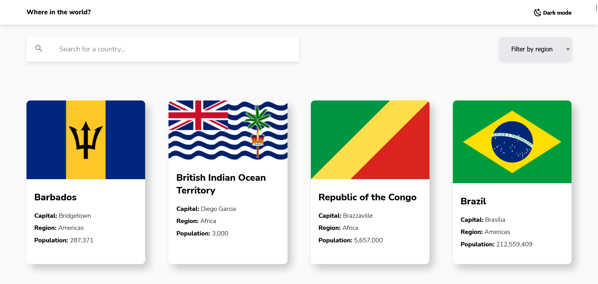

# Frontend Mentor - REST Countries API with color theme switcher solution

This is a solution to the [REST Countries API with color theme switcher challenge on Frontend Mentor](https://www.frontendmentor.io/challenges/rest-countries-api-with-color-theme-switcher-5cacc469fec04111f7b848ca). 

## Overview

### The challenge

Users should be able to:

- See all countries from the API on the homepage
- Search for a country using an `input` field
- Filter countries by region
- Click on a country to see more detailed information on a separate page
- Click through to the border countries on the detail page
- Toggle the color scheme between light and dark mode _(optional)_

### Screenshot

### Links

- Live Site URL: [Live site](https://country-mentorchallenge.netlify.app/index.html#home)

## My process

### Built with

- Semantic HTML5 markup
- CSS custom properties
- Flexbox
- CSS Grid
- Mobile-first workflow

### What I learned

I learned to create interesting animations with scss, implement different functionalities with asyn await.

### Continued development

I would like to recreate this project using a better navigation, to have a better user exeperience in my page.

## Acknowledgments

I would like to know how to implement a better navigation in my page, I tried with history.back() adding "click" event on my button element, but in this context it didn't function, I suppose because at the moement that I'm calling the function to render the HTML is creating the button, so It do not have like a "history" of it. I would appreciate any feedback to take advantage of it!.
